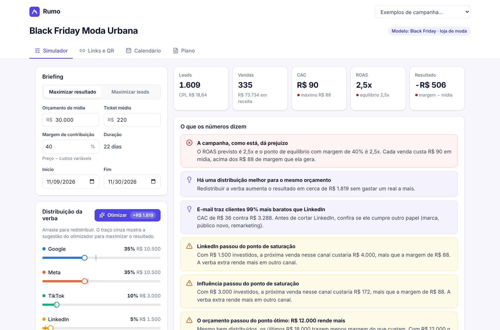
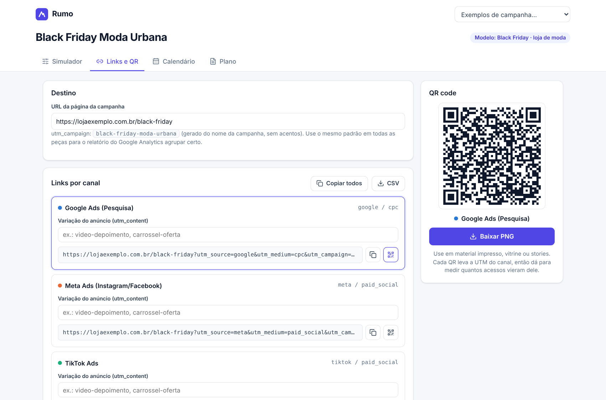
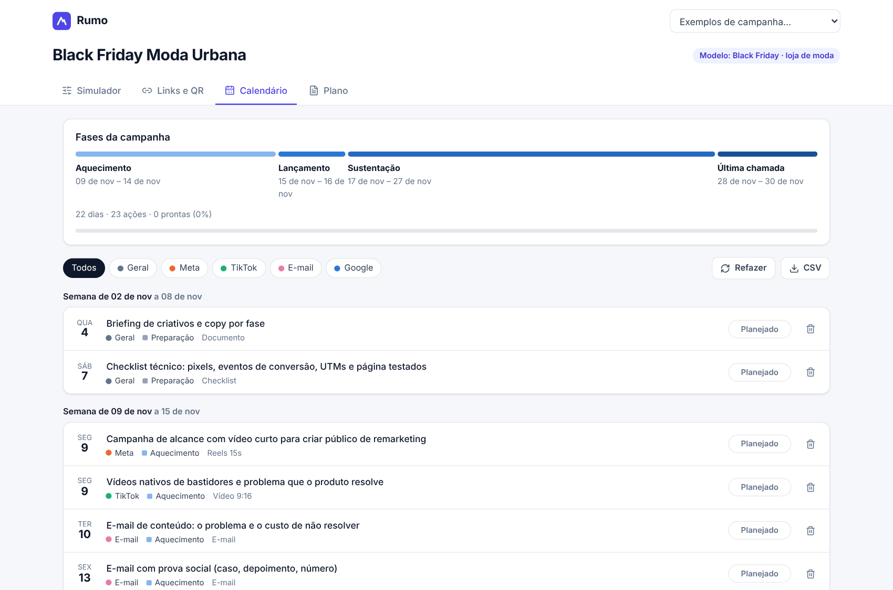
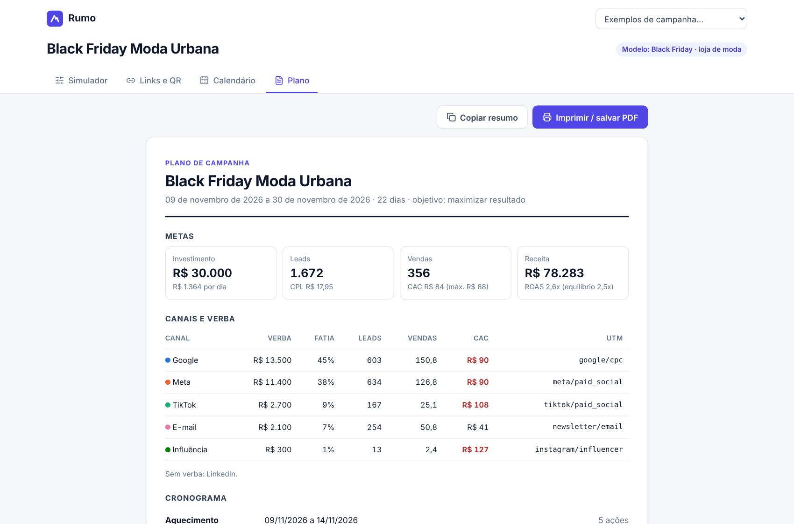
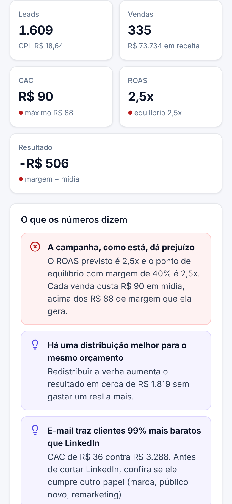

# Rumo · Planejador de campanhas

Web app para planejar uma campanha de marketing digital antes de gastar o primeiro real: simula quanto cada canal traz de leads, vendas e retorno, encontra a melhor distribuição do orçamento, gera os links rastreáveis (UTM + QR code), monta o calendário de ações e entrega um plano de uma página para o cliente.



| | |
|---|---|
|  |  |
|  |  |

## O problema

A maior parte das campanhas é planejada com um orçamento dividido "no olho" entre Google e Meta, sem saber qual CAC a operação aguenta, e com links sem UTM, o que impede de medir depois o que funcionou. O Rumo responde quatro perguntas antes de a campanha ir ao ar:

1. **Quanto essa verba deve trazer?** Leads, vendas, receita, CAC, ROAS e resultado (margem − mídia).
2. **A conta fecha?** O app compara o CAC previsto com o **CAC máximo** (ticket × margem) e o ROAS com o **ponto de equilíbrio** (1 ÷ margem).
3. **Como distribuir melhor?** O otimizador redistribui a verba para maximizar o resultado ou o volume de leads, e diz quanto isso rende a mais.
4. **O que fazer e quando?** Links prontos para cada canal, calendário por fase e regras de decisão para usar durante a campanha.

## Funcionalidades

**Simulador**
- Briefing: objetivo (resultado ou leads), orçamento, ticket médio, margem de contribuição e período.
- Distribuição por canal com sliders (Google, Meta, TikTok, LinkedIn, e-mail, influenciadores). Mexer em um canal redistribui os outros proporcionalmente, e um traço mostra a sugestão do otimizador.
- **Otimizar:** aplica a melhor distribuição e mostra o ganho no próprio botão.
- **"O que os números dizem":** insights automáticos, por exemplo:
  - a campanha dá prejuízo ou lucro;
  - há uma distribuição melhor para o mesmo orçamento;
  - um canal traz clientes X% mais baratos que outro;
  - um canal passou da saturação;
  - **o orçamento passou do ponto ótimo**, ou ainda há espaço para escalar;
  - o ritmo diário esperado.
- Funil previsto (cliques → leads → vendas), gráfico de CAC por canal com a linha do CAC máximo, e tabela detalhada.
- Premissas editáveis por canal: custo por clique, conversões, saturação e teto de verba.

**Links e QR**
- URLs com `utm_source`, `utm_medium`, `utm_campaign` (gerado do nome, sem acentos) e `utm_content` por variação de anúncio.
- Copiar um ou todos, exportar CSV e baixar o QR code de cada canal em PNG.

**Calendário**
- Gerado a partir do período e dos canais ativos, nas fases preparação → aquecimento → lançamento → sustentação → última chamada → análise.
- Ações por canal com formato. O status avança com um clique (planejado → em produção → pronto), com barra de progresso.
- Edição inline, filtro por canal, inclusão de ações e exportação CSV.
- Se o período ou os canais mudarem, o app avisa que o calendário está desatualizado.

**Plano**
- Uma página com metas, canais e verba, cronograma, **regras de decisão** (quando trocar criativo, quando escalar, qual CAC não pode passar) e indicadores com frequência de acompanhamento.
- Imprimir / salvar PDF e "Copiar resumo" para mandar por WhatsApp ou e-mail.

Três exemplos prontos: **Black Friday de loja de moda** (venda direta), **lançamento de curso online** e **geração de demanda B2B**.

## Como o cálculo funciona

Cada canal tem retorno decrescente: quanto mais se investe, mais caro fica o clique (público mais disputado, frequência maior). O custo marginal do clique é `cpc × (1 + S / saturação)`, o que dá:

```
cliques(S) = (saturação / cpc) × ln(1 + S / saturação)
leads      = cliques × taxa clique→lead
vendas     = leads × taxa lead→venda
resultado  = vendas × ticket × margem − S
```

Como cada canal é côncavo, o otimizador guloso (passos de 1% do orçamento, sempre para o canal de maior ganho marginal) chega à distribuição ótima. O mesmo modelo testa orçamentos de 20% a 300% do atual para achar o ponto em que o real seguinte deixa de se pagar. Canais limitados, como o e-mail (tamanho da base), têm um teto de verba útil.

As premissas que vêm com os exemplos são referências para demonstração. O app deixa claro que elas devem ser trocadas pelos números reais de campanhas anteriores.

## Decisões técnicas

- **React 18 + TypeScript + Vite**, sem biblioteca de UI ou de gráficos: ícones da Lucide, CSS próprio e gráficos em HTML/CSS. A única dependência extra é `qrcode`.
- **As cores dos canais seguem uma paleta categórica validada para daltonismo**, em ordem fixa. Toda barra tem rótulo e valor em texto, e existe a tabela equivalente.
- **O estado fica salvo no navegador** (`localStorage`). O app funciona offline e não precisa de back-end.
- Responsivo, com navegação por teclado e foco visível, e com layout de impressão próprio para o plano.

## Como executar

```bash
cd rumo
npm install
npm run dev       # desenvolvimento
npm run build     # gera dist/
npm run preview   # serve o build
```

## Publicar no Cloudflare

O `wrangler.toml` publica a pasta `dist/` como site estático em `https://rumo-campanhas.<sua-conta>.workers.dev`.

- **Pelo painel:** Workers & Pages → Create → Import a repository → escolha este repositório, **Root directory** `rumo`, **Deploy command** `npx wrangler deploy`.
- **Pela linha de comando:** `cd rumo && npx wrangler login && npm run deploy`.
