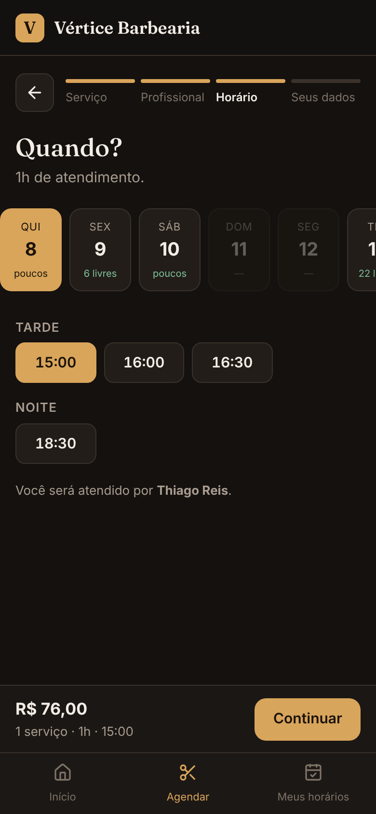
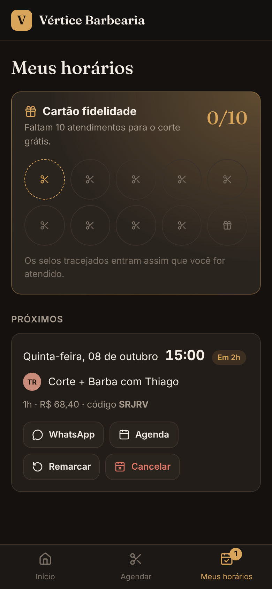
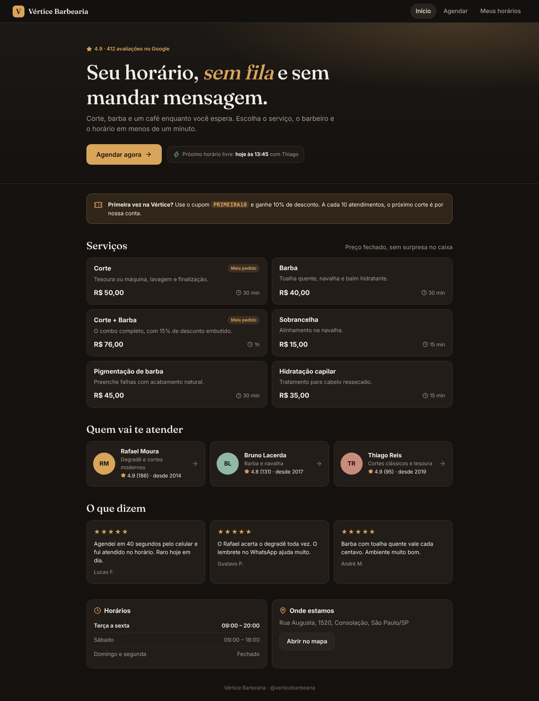

# Vértice Barbearia · Agendamento online

Web app de agendamento para barbearia, mobile-first. O cliente escolhe serviço, profissional e horário em menos de um minuto, sem trocar mensagens no WhatsApp. É um projeto de portfólio: a barbearia é fictícia.

<p>
  
  
  
  
</p>



## O problema

Em barbearias pequenas, o agendamento costuma ser feito por mensagem. Um único horário leva várias trocas ("tem às 15h?", "e às 16h?"), o barbeiro responde entre um corte e outro, e o cliente que não recebe resposta rápida vai para o concorrente. O app resolve isso em três frentes:

| Frente | Como o app atua |
|---|---|
| **Conversão** | O horário livre mais próximo aparece já na capa, cada serviço e cada barbeiro levam direto ao agendamento, e o fluxo tem 4 etapas com o total sempre visível |
| **Ticket médio** | Quem escolhe Corte e Barba separados recebe a sugestão de trocar pelo combo, que sai mais barato para o cliente e ocupa um único bloco da agenda |
| **Aquisição** | O cupom `PRIMEIRA10` dá desconto na primeira visita e só vale uma vez |
| **Retenção** | O cartão fidelidade dá um corte grátis a cada 10 atendimentos. "Repetir" e "Remarcar" levam um toque cada |
| **No-show** | O app manda a confirmação pelo WhatsApp e gera um arquivo `.ics` para a agenda do celular, com lembrete 2h antes |

## Funcionalidades

- **Início:** avaliações, serviços com preço e duração, equipe, depoimentos, horário de funcionamento (o dia atual aparece destacado) e link para o mapa.
- **Agendamento em 4 etapas** (Serviço → Profissional → Horário → Seus dados):
  - escolha de vários serviços, e a duração total define os horários possíveis;
  - opção "qualquer profissional", que junta os horários livres da casa e distribui o cliente para quem está com a agenda mais vazia;
  - os próximos 21 dias, cada um com a indicação de horários livres ("poucos" ou "N livres"), respeitando a folga de cada barbeiro, o almoço, o fechamento e uma antecedência mínima de 30 min;
  - nome e WhatsApp com máscara, cupom validado e resumo do valor.
- **Confirmação:** código do agendamento, mensagem pronta para o WhatsApp e botão para adicionar à agenda.
- **Meus horários:** próximos horários (com aviso quando faltam menos de 24h), cancelamento com confirmação, remarcação (o horário antigo só é liberado quando o novo é confirmado), histórico com "Repetir" e cartão fidelidade.

## Decisões técnicas

- **React 18 + TypeScript + Vite**, sem biblioteca de UI: ícones da Lucide e todo o CSS escrito à mão, com tema próprio.
- **A disponibilidade é calculada, não fixa.** Cada barbeiro tem dias de trabalho, a agenda é dividida em blocos de 15 min, e a ocupação dos outros clientes é simulada com um hash determinístico (sextas e sábados ficam mais cheios). Assim os horários parecem reais e se mantêm estáveis entre recarregamentos.
- **Os dados do cliente ficam no navegador** (`localStorage`). Num cliente real, essa camada seria trocada por uma API com a agenda compartilhada (por exemplo, Cloudflare Workers + D1) sem mudar as telas.
- **Acessibilidade:** navegação por teclado com foco visível, `aria-pressed`/`aria-selected` nas escolhas, contraste alto e alvos de toque grandes (44px nos botões principais).
- **Mobile-first:** navegação inferior no celular, barra de ação fixa no fluxo e leitura das áreas seguras do iPhone (`safe-area-inset`).

## Como executar

```bash
cd vertice
npm install
npm run dev       # desenvolvimento
npm run build     # gera dist/
npm run preview   # serve o build
```

## Publicar (Cloudflare Workers, assets estáticos)

O `wrangler.toml` publica a pasta `dist/` como site estático em `https://vertice-barbearia.<sua-conta>.workers.dev`.

```bash
cd vertice
npx wrangler login
npm run deploy
```

Pelo painel: **Workers & Pages → Create → Import a repository**, escolha este repositório, defina **Root directory** como `vertice` e **Deploy command** como `npx wrangler deploy`.

Também funciona em qualquer hospedagem estática (Netlify, Vercel, GitHub Pages): basta publicar o conteúdo de `dist/`.
